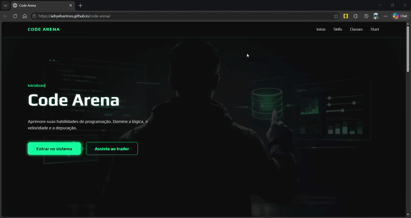
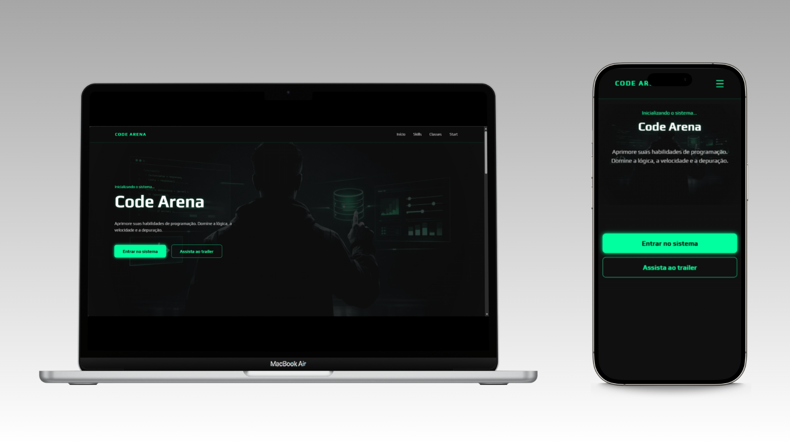

# 🎮 Code Arena

 
Uma landing page interativa inspirada no universo de jogos, mas com foco na carreira de desenvolvimento 👨‍💻⚔️

A proposta do projeto é simular a entrada em um sistema, onde o usuário escolhe seu caminho como desenvolvedor.
 

________________________________________

  

  
  
  
  

  
#### 🛠️ Tecnologias Utilizadas

________________________________________

 

## 📌 Sobre o Projeto

Esse projeto foi desenvolvido com o objetivo de praticar:

- Criação de interfaces modernas  
- Animações e microinterações  
- Estruturação de layout responsivo  
- Experiência do usuário (UI/UX)  

A ideia foi trazer uma estética futurista e imersiva, como se o usuário estivesse entrando em um jogo.

 

## 🚀 Funcionalidades

- ✨ Animações com CSS (keyframes e efeitos hover)  
- ⌨️ Efeito de digitação no Hero  
- 🎯 Scroll suave entre seções  
- 📱 Menu mobile interativo  
- 📐 Layout totalmente responsivo  

 

## 🎨 Destaques

- Design com temática futurista  
- Uso de sombras e efeitos neon  
- Microinterações que aumentam a imersão  
- Organização de código focada em clareza  

 

## 🌐 Veja online

[💻🔗<b>*Acessar Projeto*</b>](https://adryelsantoss.github.io/code-arena/)

---

 

  

